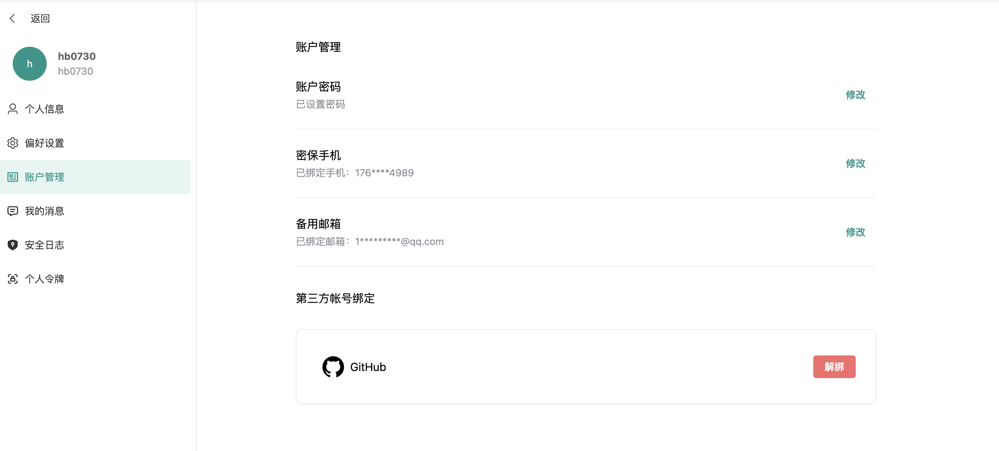
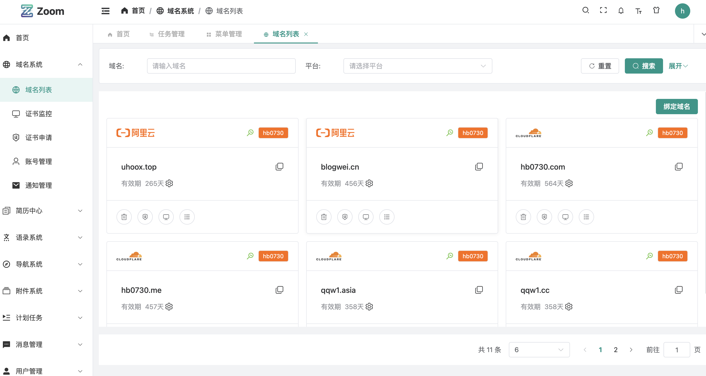
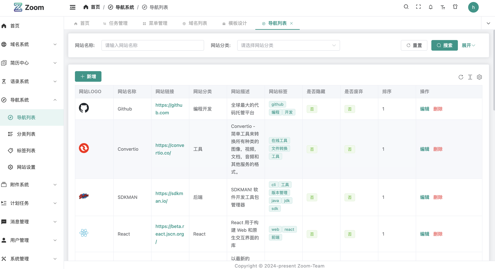
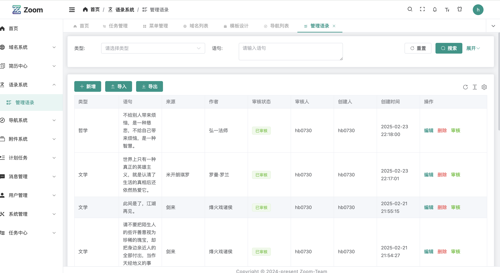
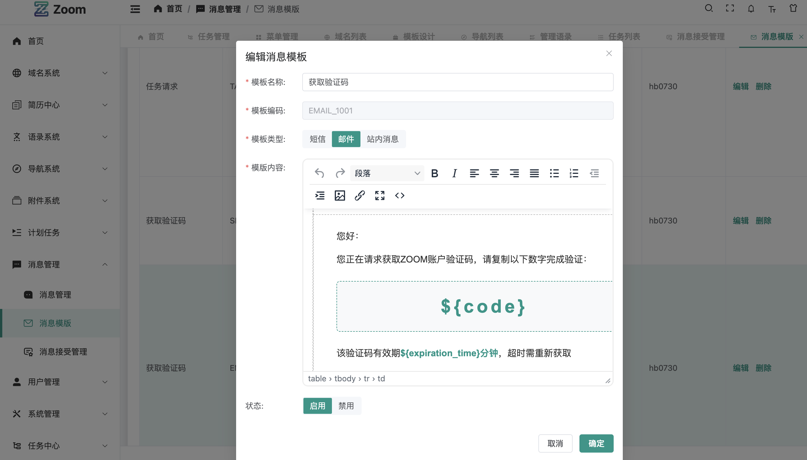
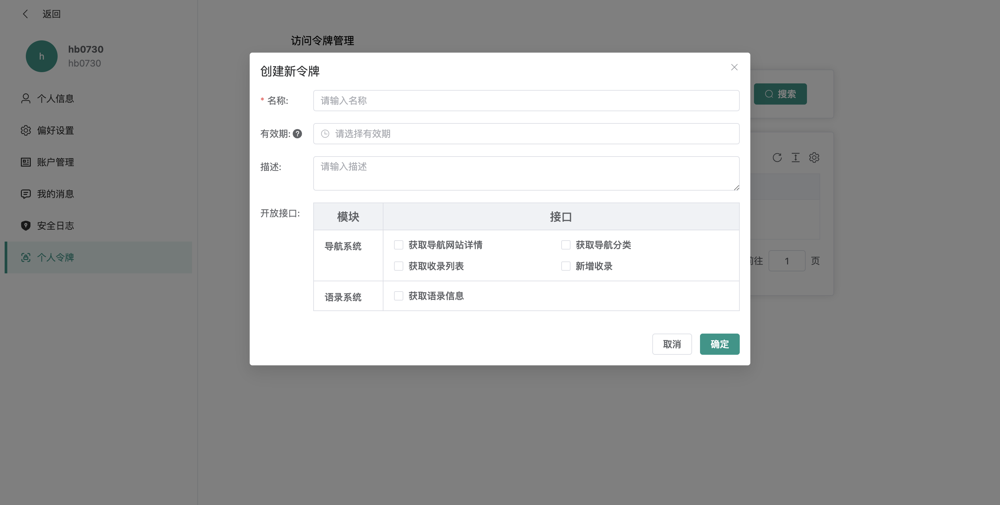

# zoom-dev

|  |  |  |
|-------------------------------|-------------------------------|-------------------------------|
|  |  |  |

ZOOM 开发环境

## 环境准备

ZOOM 开发环境依赖于以下工具：

- [jdk17](https://www.oracle.com/java/technologies/javase-jdk17-downloads.html)
- [maven](https://maven.apache.org/download.cgi)
- [docker](https://docs.docker.com/get-docker/)
- [docker-compose](https://docs.docker.com/compose/install/)

## 启动准备

在 [./infra](./infra) 目录下执行以下命令，启动依赖服务：

```docker
docker-compose up -d
```

## 启动服务

1. 先执行`zoom-pom`模块下的`mvn install`命令
2. 在启动其他`RPC-Server`
3. 最后启动`APP`模块下的`ZoomApp`类

## sql

> 用户名/密码： hb0730/qwe123!@#

所有的sql文件都在[./sql](./sql)目录下

## 如何运行

```shell
# 1. 先clone项目
git clone  --recursive -submodules https://github.com/zoom-projects/zoom-dev.git
# 2. 进入项目目录
cd zoom-dev
# 3. 先install BASIC模块
 cd BASIC && mvn install -Dmaven.test.skip=true && cd ..

# 4. 在install ENV模块
cd ENV && mvn install -Dmaven.test.skip=true && cd ..

# 6.启动APP 模块
cd APP && mvn spring-boot:run
```

## 关于前端项目

```shell
# 先行条件可以安装[Volta](https://volta.sh/)
# 1. 克隆前端项目
git clone https://github.com/zoom-projects/zoom-app-ui.git
# 2. 进入项目目录
cd zoom-app-ui
# 3. 安装依赖
pnpm install
# 4. 启动项目
pnpm run dev
```
